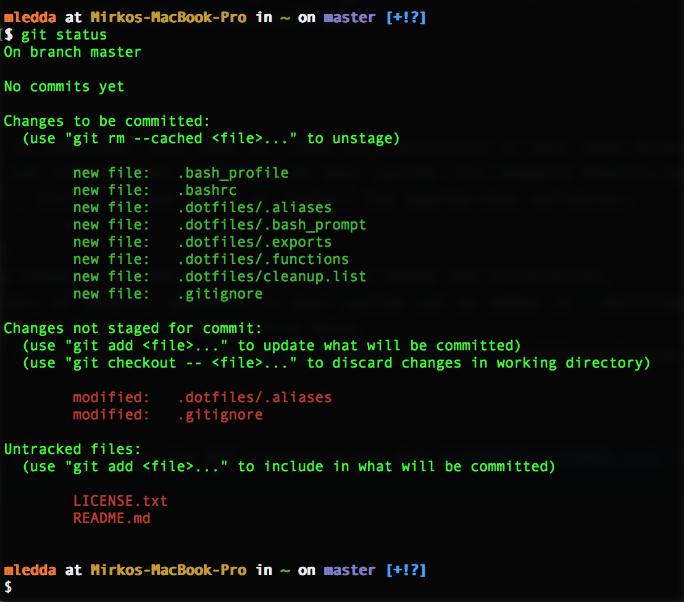

# My dotfiles
These are my personal dotfiles which were heavily inspired by [@mathiasbynens](https://github.com/mathiasbynens/dotfiles).

## What Is It?
If you don't know what dotfiles are (e.g. `.bash_profile`) then **please stay away from this repo**. Otherwise, here a screenshot of the terminal you will get:



## Installation
No installation is required. Before proceeding, I would suggest you backup your local dotfiles. Now, clone the content of this repo into your home directory with

```
git clone https://github.com/MirkoLedda/.dotfiles ~
```

Note that some functions might use software not installed on your system (for example GhostScript `gs` is used for the alias `mergepdf`). Either remove these or install the appropriate software.

## Configuration
1. Please review these files carefully and adapt them to your needs and preferences.
2. Extras functions or imports which are specific to your system can be added in `.dotfiles/.extras`. For obvious reasons, I did not include my `.extras` file here.
3. The function `deepcleanup` will remove recursively all files listed in `.dotfiles/cleanup.list`. Adapt this list to your needs.

## Contributing
Contributions are welcome! If you have new functionalities that you think can be useful to a large audience then feel free to open a [pull request](https://github.com/MirkoLedda/.dotfiles/pulls).

## License
These files are licensed under the MIT License - see the [LICENSE](LICENSE.txt) file for details.
